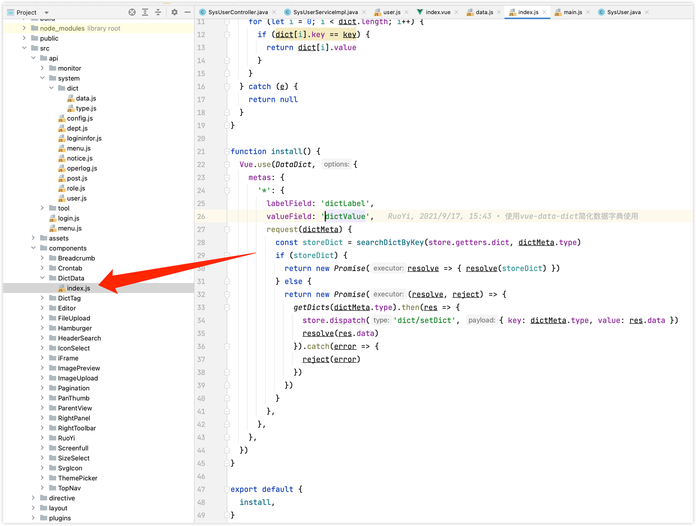

# 架构

[架构图](https://processon.com/view/link/5f4f4b2b0791296b0ef439c9)

# 部署

swagger访问地址

http://localhost:8080/swagger-ui/index.html


spring boot admin页面

http://localhost:9100/

用户名和密码的配置在nacos中

ruoyi/123456


由于是微服务项目，需要启动多个服务，占用多个端口，有可能端口被本地程序占用，导致某个微服务启动不了，可以使用

```
lsof -i:8080
# list of open files
```

命令来查看占用端口的程序，kill -9 pid杀掉

# 用户管理的实现

## 枚举值的处理方式

状态和性别这种枚举值，在数据库里，RuoYi-Cloud是用char(1)存储的

还有一个删除标记，也是char(1)，逻辑删除

返回回去，并没有做转换，直接返回数据库里的值，比如数据库存的性别是1，返回的也是1

前端如何转换显示的？

前端在请求用户列表页的同时，还请求了字典接口，system/dict/data/type/sys_normal_disable和/system/dict/data/type/sys_user_sex

前端什么时候请求了字典接口？

在dict/data.js中，定义了getDicts方法，根据字典类型，调用字典接口


getDicts方法在DictData组件中定义了install方法，内部调用了getDicts方法



DictData组件的install方法，是在main.js中调用的

```javascript
// 全局方法挂载
Vue.prototype.getDicts = getDicts
DictData.install()
```

在user/index.vue中
```vue
export default {
  name: "User",
  dicts: ['sys_normal_disable', 'sys_user_sex'],
```

默认导入了两个字典类型，然后使用了[vue-data-dict](https://github.com/moxun1639/vue-data-dict)组件进行字典的自动导入

一些列的对字典的解析转换，在这个下面


配置一下这个[vue-data-dict](https://github.com/moxun1639/vue-data-dict)


根据[vue-data-dict](https://github.com/moxun1639/vue-data-dict)的使用说明，只用定义字典类型就可以


具体实现在这里


> 学会了vue项目在浏览器里直接断点调试

小结：

总体来说，字典的转化，是在前端做的，后端接口实现比较简单，直接返回了数据库里面存储的数据。不像我们之前实现的方式，都是后端转换好后，返回给前端。

这样做的好处是什么？一般来说，前端不愿意去做数据转化，他们认为前端只要拿到数据做渲染就行了。转化属于逻辑处理，应该后端做。

