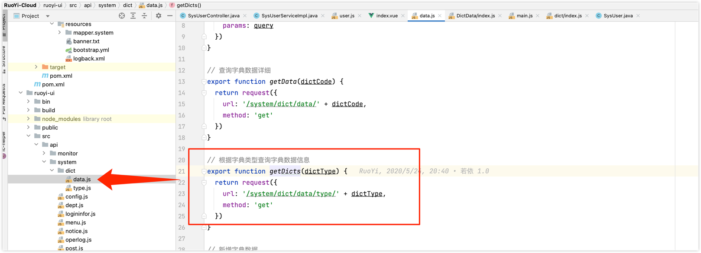
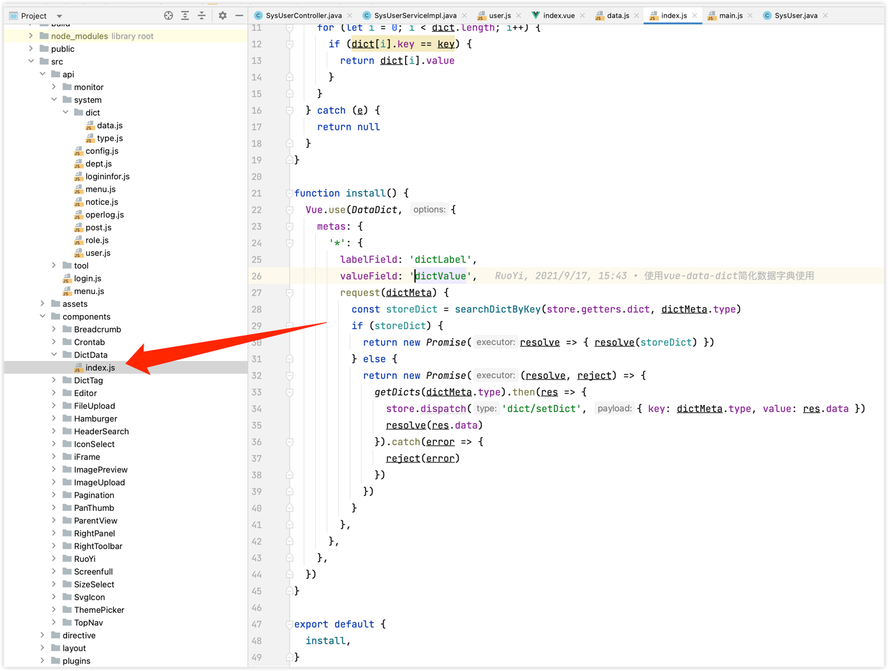
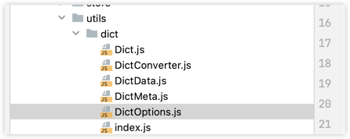
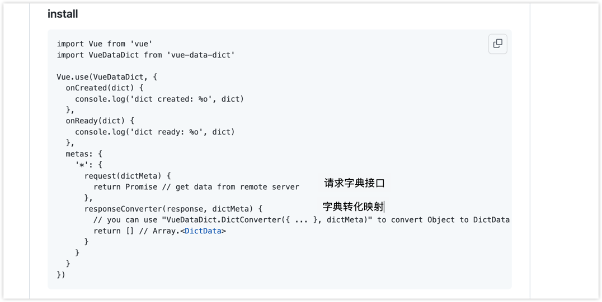
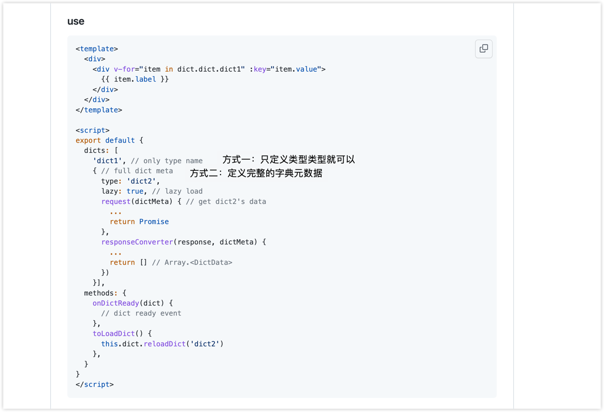
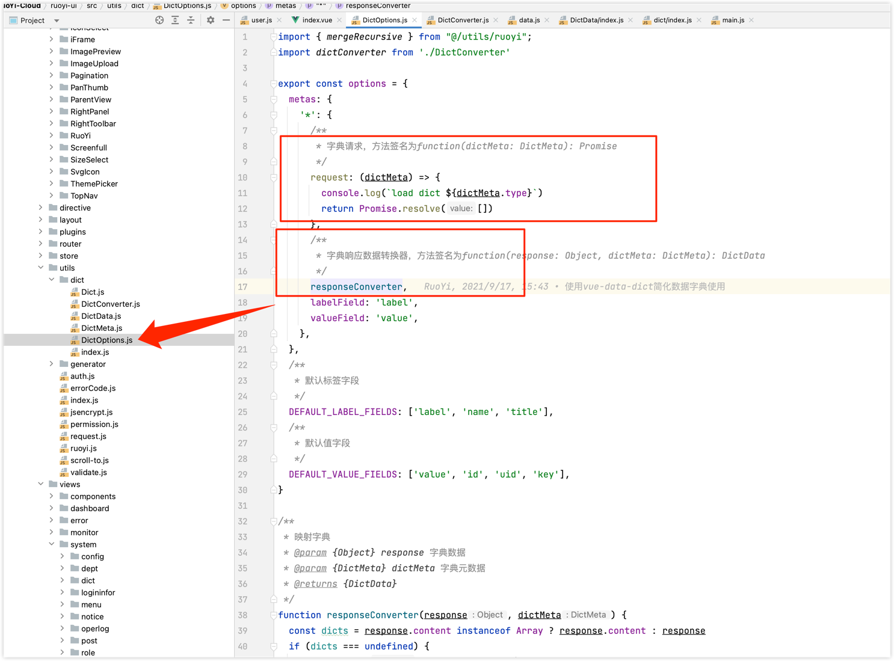
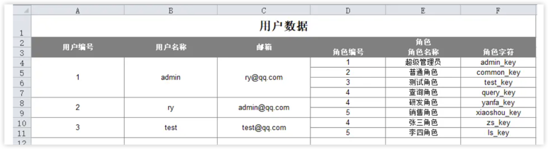

# 架构

[架构图](https://processon.com/view/link/5f4f4b2b0791296b0ef439c9)

# 部署

## swagger访问地址

http://localhost:8080/swagger-ui/index.html


## spring boot admin页面

http://localhost:9100/

用户名和密码的配置在nacos中

ruoyi/123456


## 查看占用端口的进程
由于是微服务项目，需要启动多个服务，占用多个端口，有可能端口被本地程序占用，导致某个微服务启动不了，可以使用

```
lsof -i:8080
# list of open files
```

命令来查看占用端口的程序，kill -9 pid杀掉

## Docker报错：tried to kill container, but did not receive an exit event

```shell
killall Docker && open /Applications/Docker.app
```

## nacos本地启动命令
```shell
./bin/startup.sh -m standalone
```

http://localhost:8848/nacos

默认用户名密码nacos

### 配置nacos持久化

修改conf/application.properties文件(nacos-server包conf目录下)，增加支持mysql数据源配置

```properties
# db mysql
spring.datasource.platform=mysql
db.num=1
db.url.0=jdbc:mysql://localhost:3306/ry-config?characterEncoding=utf8&connectTimeout=1000&socketTimeout=3000&autoReconnect=true&useUnicode=true&useSSL=false&serverTimezone=UTC
db.user=root
db.password=password
```

## 创建数据库和表

1、创建数据库ry-cloud并导入数据脚本ry_2021xxxx.sql（必须），quartz.sql（可选）

2、创建数据库ry-config并导入数据脚本ry_config_2021xxxx.sql（必须）


## sentinel本地启动命令
```shell
java -Dserver.port=8718 -Dcsp.sentinel.dashboard.server=localhost:8718 -Dproject.name=sentinel-dashboard -Dcsp.sentinel.api.port=8719 -jar sentinel-dashboard-1.8.5.jar
```

http://localhost:8718/

默认用户名密码sentinel

## 运行基础模块（启动没有先后顺序）

打开运行基础模块（启动没有先后顺序）

- RuoYiGatewayApplication （网关模块 必须）
- RuoYiAuthApplication （认证模块 必须）
- RuoYiSystemApplication （系统模块 必须）
- RuoYiMonitorApplication （监控中心 可选）
- RuoYiGenApplication （代码生成 可选）
- RuoYiJobApplication （定时任务 可选）
- RuoYFileApplication （文件服务 可选）

## 集成seata

集成seata分布式事务（可选配置，默认不启用）

创建数据库ry-seata并导入数据脚本ry_seata_2021xxxx.sql

> 运行前需要先启动nacos，运行成功可以通过(http://localhost:8080 (opens new window))访问，但是不会出现静态页面

# 前端运行

```shell
# 进入项目目录
cd ruoyi-ui

# 安装依赖
npm install

# 强烈建议不要用直接使用 cnpm 安装，会有各种诡异的 bug，可以通过重新指定 registry 来解决 npm 安装速度慢的问题。
npm install --registry=https://registry.npmmirror.com

# 本地开发 启动项目
npm run dev
```

打开浏览器，输入：(http://localhost:80 (opens new window)) 默认账户/密码 admin/admin123）
若能正确展示登录页面，并能成功登录，菜单及页面展示正常，则表明环境搭建成功

建议使用Git克隆，因为克隆的方式可以和RuoYi随时保持更新同步。使用Git命令克隆

git clone https://gitee.com/y_project/RuoYi-Cloud.git

> 因为本项目是前后端完全分离的，所以需要前后端都单独启动好，才能进行访问。
前端安装完node后，最好设置下淘宝的镜像源，不建议使用cnpm（可能会出现奇怪的问题）

# 用户管理的实现

## 枚举值的处理方式

状态和性别这种枚举值，在数据库里，RuoYi-Cloud是用char(1)存储的

还有一个删除标记，也是char(1)，逻辑删除

返回回去，并没有做转换，直接返回数据库里的值，比如数据库存的性别是1，返回的也是1

前端如何转换显示的？

前端在请求用户列表页的同时，还请求了字典接口，system/dict/data/type/sys_normal_disable和/system/dict/data/type/sys_user_sex

前端什么时候请求了字典接口？

在dict/data.js中，定义了getDicts方法，根据字典类型，调用字典接口


getDicts方法在DictData组件中定义了install方法，内部调用了getDicts方法



DictData组件的install方法，是在main.js中调用的

```javascript
// 全局方法挂载
Vue.prototype.getDicts = getDicts
DictData.install()
```

在user/index.vue中
```vue
export default {
  name: "User",
  dicts: ['sys_normal_disable', 'sys_user_sex'],
```

默认导入了两个字典类型，然后使用了[vue-data-dict](https://github.com/moxun1639/vue-data-dict)组件进行字典的自动导入

一些列的对字典的解析转换，在这个下面



配置一下这个[vue-data-dict](https://github.com/moxun1639/vue-data-dict)



根据[vue-data-dict](https://github.com/moxun1639/vue-data-dict)的使用说明，只用定义字典类型就可以



具体实现在这里



> 学会了vue项目在浏览器里直接断点调试

小结：

总体来说，字典的转化，是在前端做的，后端接口实现比较简单，直接返回了数据库里面存储的数据。不像我们之前实现的方式，都是后端转换好后，返回给前端。

这样做的好处是什么？一般来说，前端不愿意去做数据转化，他们认为前端只要拿到数据做渲染就行了。转化属于逻辑处理，应该后端做。

> 字典转换逻辑在前端还是后端处理的问题，没有好坏之分，从clean code的角度来说，接口定义的越简单越好，后端接口返回数据库里的数据，不做任何转换，对后端来说比较清晰。

# 其他后端内容

## 导入导出的实现

高级部分：关注下默认的能力，可以做到什么程度

- 自定义导入导出标题信息
- 自定义数据处理器（对某一个字段属性处理）
- 自定义隐藏属性列
- 导出对象的子列表（可以做到自动合并单元格），比如一个人有多个角色，可以导出这个人每个角色的角色内字段


## 文件上传下载的实现

## 权限注解的能力

- 登录认证
- 权限认证
- 角色认证

## 事务管理

- Spring默认不会回滚检查异常，需要指定rollbackFor = Exception.class
- 在业务层捕获了异常，导致事务不生效。不应该在业务层捕获异常，应该抛出异常，在控制层统一处理

为什么需要传播行为控制？

> 事务的传播机制是指如果在开始当前事务之前，一个事务上下文已经存在，此时有若干选项可以指定一个事务性方法的执行行为。 即:在执行一个@Transactinal注解标注的方法时，开启了事务；当该方法还在执行中时，另一个人也触发了该方法；那么此时怎么算事务呢，这时就可以通过事务的传播机制来指定处理方式。


TransactionDefinition.PROPAGATION_REQUIRED	如果当前存在事务，则加入该事务；如果当前没有事务，则创建一个新的事务。这是默认值。

## 异常处理

### `@ControllerAdvice`注解或者`@RestControllerAdvice`注解

全局异常处理器就是使用`@ControllerAdvice`注解或者`@RestControllerAdvice`注解。

原理参见`RequestMappingHandlerAdapter.initControllerAdviceCache`

### `@InitBinder`注解和`@NotBlank`注解
`InitBinder`注解，用于在请求到达`Controller`前，对参数进行转化。比如对字符串参数进行去空格，对String类型的日期转换成Date类型。

> `@NotBlank`注解本身就可以对字符串参数进行去空格后验证长度是否为0，见`NotBlankValidator`类

### 无法捕获异常的几种可能

- 异常是否已被处理，即抛出异常后被catch，打印了日志或抛出了其它异常
- 异常是否非Controller抛出，即在拦截器或过滤器中出现的异常

## 参数校验

Controller方法参数前加`@Validated`注解，参数类的字段上加上各种校验的注解

### [自定义注解校验](http://doc.ruoyi.vip/ruoyi/document/htsc.html#%E8%87%AA%E5%AE%9A%E4%B9%89%E6%B3%A8%E8%A7%A3%E6%A0%A1%E9%AA%8C)

比如想做一个防止表单提交时，通过注入手段进行攻击的校验，

可以自定义一个Xss注解和校验器，可以在某个字段上加`@Xss`注解。如果要全局生效，可以在所有controller的父类controller里面使用`@InitBinder`注解来校验字符串类型

除了使用注解，也可以单独在方法里面进行验证

```java
@Autowired
protected Validator validator;

public void importUser(SysUser user)
{
    BeanValidators.validateWithException(validator, user);
}
```

### [自定义分组校验](http://doc.ruoyi.vip/ruoyi/document/htsc.html#%E8%87%AA%E5%AE%9A%E4%B9%89%E5%88%86%E7%BB%84%E6%A0%A1%E9%AA%8C)

需求来源：前面都是对一个类的属性进行校验，如果一个类的属性，在新增的时候需要校验，编辑的时候不需要校验，难道要定义另外一个相同的类？

可以使用分组校验，加上分组标记。

## 如何在SpringMVC的请求参数中使用枚举

了解了[如何在SpringMVC的请求参数中使用枚举](https://www.baeldung.com/spring-enum-request-param)。主要会用到`StringToEnumConverterFactory`这个类。

内部实现最终调用了`Enum.valueOf`

`StringToEnumConverterFactory`属于**spring-core**模块下的convert包，**spring-core**模块后续要好好学一下。

## [如何多次读取HttpServletRequest？](https://www.baeldung.com/spring-reading-httpservletrequest-multiple-times)

继承`HttpServletRequestWrapper`，将inputstream缓存起来，最后加入到`OncePerRequestFilter`的filter chain中

## [OncePerRequestFilter的作用](https://www.baeldung.com/spring-onceperrequestfilter)

## 系统日志

记录谁对什么功能，进行了什么操作

利用注解+AOP切面对方式实现

## 数据权限

### 什么是数据权限？

是指登录到系统后，可以查看哪些部门的数据

### 和菜单权限的不同

菜单权限是描述角色拥有哪些菜单，数据权限控制的更细，主要控制部门间的数据权限。

比如，销售和财务数据是不允许别的部门的人和未授权的人看到的

### 具体实现：

定义了`@DataScope`注解，及用户表和部门表的别名参数。

在Mybatis查询底部加上

```xml
${params.dataScope}
```

逻辑实现代码 `com.ruoyi.framework.aspectj.DataScopeAspect`

`DataScopeAspect`里面的代码是通过sql拼接完成的，

### 另外一种实现方式

可以是使用Mybatis的动态sql，

1、为mapper接口中参数的类型定义一个父类，父类中包含数据权限的入参字段，比如
`userAlias`，`deptAlias`，`userId`，`deptId`等，

2、新建一个数据权限的mapper接口`com.xx.xxx.DataPermissionCommonMapper`

3、为数据权限mapper接口定义一个sql statement，指定id

```xml
<mapper namespace="com.xx.xxx.DataPermissionCommonMapper">
    <sql id="data_permission">
        <if test="dataPermission.deptAlias != null">
            or #{deptAlias}.dept_id = #{deptId}
        </if>
        <if test="dataPermission.deptAlias != null and dataPermission.type == 4">
            or #{deptAlias}.dept_id in 
        </if>
    </sql>
</mapper>
```

4、在用到的数据权限的地方，通过在mapper的xml中include步骤3定义的sql，引入。

```xml
<if test="dataPermission != null">
    and (
            <include refid="com.xx.xxx.DataPermissionCommonMapper.data_permission"/>
    )
</if>
```

## 动态数据源

微服务版使用了dynamic-datasource动态多数据源组件。

- 自动切换，是通过注解
- 手动切换

```java
DynamicDataSourceContextHolder.push("slave"); // 手动切换
....业务逻辑
DynamicDataSourceContextHolder.clear();
```

具体实现可以看该组件，或者看RuoYi单机版的实现

大致思路
1. 定义数据源注解、数据源枚举
2. yml中配置多数据源
3. 在druid数据源配置中，添加另外的数据源
```java
    @Bean
    @ConfigurationProperties("spring.datasource.druid.slave")
    @ConditionalOnProperty(prefix = "spring.datasource.druid.slave", name = "enabled", havingValue = "true")
    public DataSource slaveDataSource(DruidProperties druidProperties)
    {
        DruidDataSource dataSource = DruidDataSourceBuilder.create().build();
        return druidProperties.dataSource(dataSource);
    }
```
4. 在druid数据源配置类中添加另外的数据源
```java
    @Bean(name = "dynamicDataSource")
    @Primary
    public DynamicDataSource dataSource(DataSource masterDataSource)
    {
        Map<Object, Object> targetDataSources = new HashMap<>();
        targetDataSources.put(DataSourceType.MASTER.name(), masterDataSource);
        setDataSource(targetDataSources, DataSourceType.SLAVE.name(), "slaveDataSource");
        return new DynamicDataSource(masterDataSource, targetDataSources);
    }

    /**
     * 设置数据源
     * 
     * @param targetDataSources 备选数据源集合
     * @param sourceName 数据源名称
     * @param beanName bean名称
     */
    public void setDataSource(Map<Object, Object> targetDataSources, String sourceName, String beanName)
    {
        try
        {
            DataSource dataSource = SpringUtils.getBean(beanName);
            targetDataSources.put(sourceName, dataSource);
        }
        catch (Exception e)
        {
        }
    }
```
5. 定义动态数据源切面，用于拦截方法上有数据源注解的方法，在该方法的前后进行数据源切换，设置到线程上下文中（一个ThreadLocal变量）
```java
    @Around("dsPointCut()")
    public Object around(ProceedingJoinPoint point) throws Throwable
    {
        DataSource dataSource = getDataSource(point);

        if (StringUtils.isNotNull(dataSource))
        {
            DynamicDataSourceContextHolder.setDataSourceType(dataSource.value().name());
        }

        try
        {
            return point.proceed();
        }
        finally
        {
            // 销毁数据源 在执行方法之后
            DynamicDataSourceContextHolder.clearDataSourceType();
        }
    }
```

6. 定义一个`DynamicDataSource`类，继承`AbstractRoutingDataSource`，实现`determineCurrentLookupKey`方法，并在该方法中，从线程上下文中取出数据源
```java
public class DynamicDataSource extends AbstractRoutingDataSource
{
    public DynamicDataSource(DataSource defaultTargetDataSource, Map<Object, Object> targetDataSources)
    {
        super.setDefaultTargetDataSource(defaultTargetDataSource);
        super.setTargetDataSources(targetDataSources);
        super.afterPropertiesSet();
    }

    @Override
    protected Object determineCurrentLookupKey()
    {
        return DynamicDataSourceContextHolder.getDataSourceType();
    }
}
```

## 代码生成

目的：消除重复代码，比如curd

## 定时任务

使用场景
- 数据比对
- 数据同步
- 定时生成报表
- 定时清理数据

数据表里保存了定时任务的元数据信息，
定时任务会在系统启动或者新增定时任务时，加入到内存中，

启用时，会去调用具体的任务类的方法

官方文档给出了一些cron表达式的例子，可以在以后写cron表达式时，根据需求[参考](http://doc.ruoyi.vip/ruoyi/document/htsc.html#%E5%AE%9A%E6%97%B6%E4%BB%BB%E5%8A%A1)下

## 接口文档

Swagger接口文档RuoYi Cloud提供的使用方式很具体，可以在需要查阅的时候[参考](http://doc.ruoyi.vip/ruoyi/document/htsc.html#%E7%B3%BB%E7%BB%9F%E6%8E%A5%E5%8F%A3)。

## 防重复提交

目的：防止会话重放攻击

使用：方法上加`@RepeatSubmit`注解

前端实现request.js
```javascript
      const s_url = sessionObj.url;                  // 请求地址
      const s_data = sessionObj.data;                // 请求数据
      const s_time = sessionObj.time;                // 请求时间
      const interval = 1000;                         // 间隔时间(ms)，小于此时间视为重复提交
      if (s_data === requestObj.data && requestObj.time - s_time < interval && s_url === requestObj.url) {
        const message = '数据正在处理，请勿重复提交';
        console.warn(`[${s_url}]: ` + message)
        return Promise.reject(new Error(message))
      } else {
        cache.session.setJSON('sessionObj', requestObj)
      }
```

## 国际化

了解即可

配置不同的国际化资源，在切换时会用到

## 新建子模块

需要新建时，照着文档操作即可

# 前端手册部分

1. 通用方法，告诉使用者，前端通用的一些方法。
2. 开发规范，告诉使用者，如何新开发一个页面。
3. 请求流程，告诉使用者，request.js中封装了全局request拦截器、response拦截器、统一的错误处理、统一做了超时处理、baseURL设置
    3.1.api文件夹，用来为存放每个模块的请求处理
4. 引入依赖的方式
5. 路由使用方式。路由文件在router/index.js中。
通过新建菜单配置路由，会动态创建路由，不需要在router/index.js中配置
   
代表那些需要根据用户动态判断权限并通过addRoutes动态添加的页面，在`@/store/modules/permission`加载后端接口路由配置。

> - 动态路由可以在系统管理-菜单管理进行新增和修改操作，前端加载会自动请求接口获取菜单信息并转换成前端对应的路由。
> - 动态路由在生产环境下会默认使用路由懒加载，实现方式参考loadView方法的判断。

6. 组件使用方式，

- 引入和使用外部组件
- 自定义组件并使用
  - 组件通信：通过props来接收外界传递到组件内部的值
  - 组件通信：使用$emit监听子组件触发的事件
7. 权限使用
8. 多级目录
9. 页签缓存：菜单管理中可以配置，默认缓存。要写对路由和组件view的name，根据name匹配，匹配不到，或者不写name不会缓存。
10. 使用图标。注意图标中图标的规格，RuoYi Cloud中图标都是 128*128 大小规格的
11. 数据字典，前面分析后端手册中字典的部分已经分析过其实现
12. 使用参数（配置）。动态修改配置，不需要去频繁修改配置文件。
13. 异常处理。
14. 应用路径。针对部署在不同的路径下的情况
15. 内容复制。