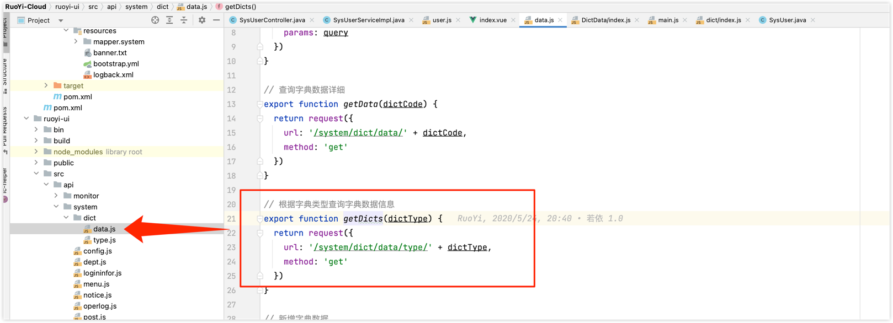
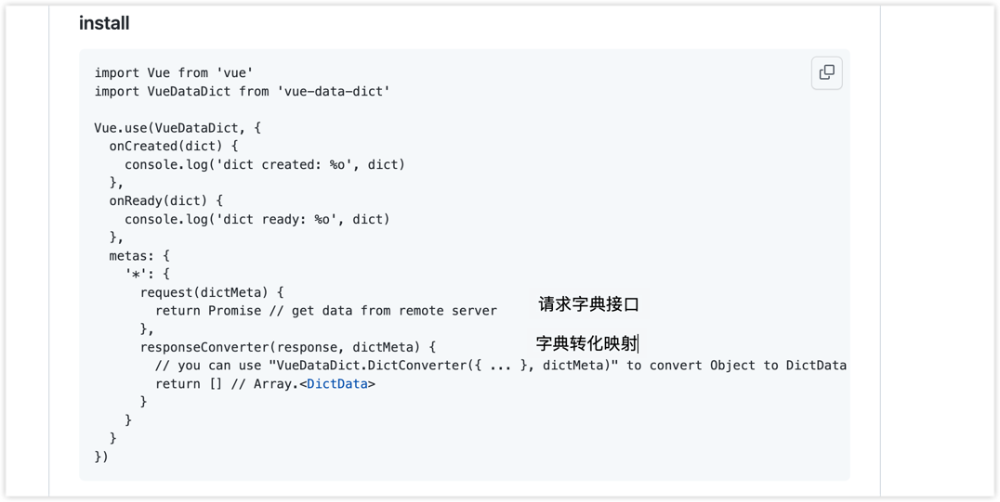
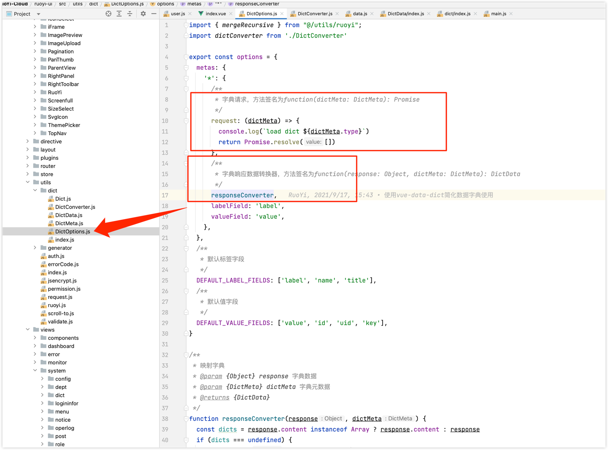

# 架构

[架构图](https://processon.com/view/link/5f4f4b2b0791296b0ef439c9)

# 部署

swagger访问地址

http://localhost:8080/swagger-ui/index.html


spring boot admin页面

http://localhost:9100/

用户名和密码的配置在nacos中

ruoyi/123456


由于是微服务项目，需要启动多个服务，占用多个端口，有可能端口被本地程序占用，导致某个微服务启动不了，可以使用

```
lsof -i:8080
# list of open files
```

命令来查看占用端口的程序，kill -9 pid杀掉

# 用户管理的实现

## 枚举值的处理方式

状态和性别这种枚举值，在数据库里，RuoYi-Cloud是用char(1)存储的

还有一个删除标记，也是char(1)，逻辑删除

返回回去，并没有做转换，直接返回数据库里的值，比如数据库存的性别是1，返回的也是1

前端如何转换显示的？

前端在请求用户列表页的同时，还请求了字典接口，system/dict/data/type/sys_normal_disable和/system/dict/data/type/sys_user_sex

前端什么时候请求了字典接口？

在dict/data.js中，定义了getDicts方法，根据字典类型，调用字典接口


getDicts方法在DictData组件中定义了install方法，内部调用了getDicts方法


DictData组件的install方法，是在main.js中调用的

```javascript
// 全局方法挂载
Vue.prototype.getDicts = getDicts
DictData.install()
```

在user/index.vue中
```vue
export default {
  name: "User",
  dicts: ['sys_normal_disable', 'sys_user_sex'],
```

默认导入了两个字典类型，然后使用了[vue-data-dict](https://github.com/moxun1639/vue-data-dict)组件进行字典的自动导入

一些列的对字典的解析转换，在这个下面


配置一下这个[vue-data-dict](https://github.com/moxun1639/vue-data-dict)



根据[vue-data-dict](https://github.com/moxun1639/vue-data-dict)的使用说明，只用定义字典类型就可以


具体实现在这里



> 学会了vue项目在浏览器里直接断点调试

小结：

总体来说，字典的转化，是在前端做的，后端接口实现比较简单，直接返回了数据库里面存储的数据。不像我们之前实现的方式，都是后端转换好后，返回给前端。

这样做的好处是什么？一般来说，前端不愿意去做数据转化，他们认为前端只要拿到数据做渲染就行了。转化属于逻辑处理，应该后端做。

> 字典转换逻辑在前端还是后端处理的问题，没有好坏之分，从clean code的角度来说，接口定义的越简单越好，后端接口返回数据库里的数据，不做任何转换，对后端来说比较清晰。

## 导入导出的实现

高级部分：关注下默认的能力，可以做到什么程度

- 自定义导入导出标题信息
- 自定义数据处理器（对某一个字段属性处理）
- 自定义隐藏属性列
- 导出对象的子列表（可以做到自动合并单元格），比如一个人有多个角色，可以导出这个人每个角色的角色内字段


## 文件上传下载的实现

## 权限注解的能力

- 登录认证
- 权限认证
- 角色认证

## 事务管理

- Spring默认不会回滚检查异常，需要指定rollbackFor = Exception.class
- 在业务层捕获了异常，导致事务不生效。不应该在业务层捕获异常，应该抛出异常，在控制层统一处理

为什么需要传播行为控制？

> 事务的传播机制是指如果在开始当前事务之前，一个事务上下文已经存在，此时有若干选项可以指定一个事务性方法的执行行为。 即:在执行一个@Transactinal注解标注的方法时，开启了事务；当该方法还在执行中时，另一个人也触发了该方法；那么此时怎么算事务呢，这时就可以通过事务的传播机制来指定处理方式。


TransactionDefinition.PROPAGATION_REQUIRED	如果当前存在事务，则加入该事务；如果当前没有事务，则创建一个新的事务。这是默认值。

## 异常处理

### `@ControllerAdvice`注解或者`@RestControllerAdvice`注解

全局异常处理器就是使用`@ControllerAdvice`注解或者`@RestControllerAdvice`注解。

原理参见`RequestMappingHandlerAdapter.initControllerAdviceCache`

### `@InitBinder`注解和`@NotBlank`注解
`InitBinder`注解，用于在请求到达`Controller`前，对参数进行转化。比如对字符串参数进行去空格，对String类型对日期转换成Date类型。

`@NotBlank`注解本身就可以对字符串参数进行去空格后验证长度是否为0，见`NotBlankValidator`类

### 无法捕获异常的几种可能

- 异常是否已被处理，即抛出异常后被catch，打印了日志或抛出了其它异常
- 异常是否非Controller抛出，即在拦截器或过滤器中出现的异常

## 参数校验

Controller方法参数前加`@Validated`注解，参数类的字段上加上各种校验的注解

### [自定义注解校验](http://doc.ruoyi.vip/ruoyi/document/htsc.html#%E8%87%AA%E5%AE%9A%E4%B9%89%E6%B3%A8%E8%A7%A3%E6%A0%A1%E9%AA%8C)

比如想做一个防止表单提交时，通过注入手段进行攻击的校验，

可以自定义一个Xss注解和校验器，可以在某个字段上加`@Xss`注解，全剧生效，可以在所有controller的父类controller里面使用`@InitBinder`注解来校验字符串类型

除了使用注解，也可以单独在方法里面进行验证

```java
@Autowired
protected Validator validator;

public void importUser(SysUser user)
{
    BeanValidators.validateWithException(validator, user);
}
```

### [自定义分组校验](http://doc.ruoyi.vip/ruoyi/document/htsc.html#%E8%87%AA%E5%AE%9A%E4%B9%89%E5%88%86%E7%BB%84%E6%A0%A1%E9%AA%8C)

需求来源：前面都是对一个类的属性进行校验，如果一个类的属性，在新增的时候需要校验，编辑的时候不需要校验，难道要定义另外一个相同的类？

可以使用分组校验，加上分组标记。

## 如何在SpringMVC的请求参数中使用枚举

了解了[如何在SpringMVC的请求参数中使用枚举](https://www.baeldung.com/spring-enum-request-param)。主要会用到`StringToEnumConverterFactory`这个类。

内部实现最终调用了`Enum.valueOf`

`StringToEnumConverterFactory`属于**spring-core**模块下的convert包，**spring-core**模块后续要好好学一下。

## [如何多次读取HttpServletRequest？](https://www.baeldung.com/spring-reading-httpservletrequest-multiple-times)

继承`HttpServletRequestWrapper`，将inputstream缓存起来，最后加入到`OncePerRequestFilter`的filter chain中

## [OncePerRequestFilter的作用](https://www.baeldung.com/spring-onceperrequestfilter)

