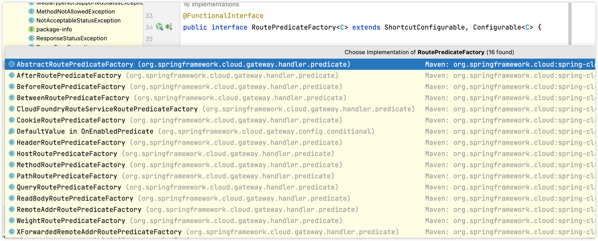
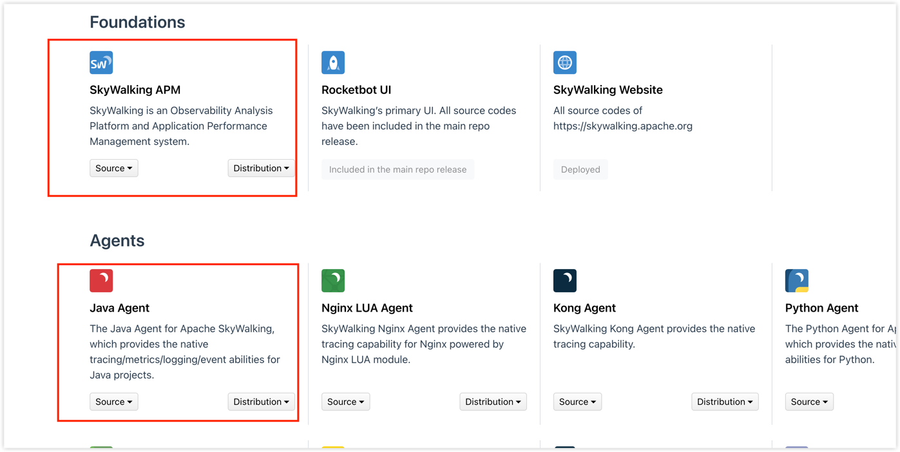

# 服务网关

## 基本介绍

### 设计模式

门面模式

### 为什么用？

客户端相关的请求直接发送到网关，由网关根据请求标识 解析判断出具体的微服务地址，再把请求转发到微服务实例。

客户端不需要知道具体服务的IP、域名，只需知道服务名就可以。

为所有服务的API提供跨领域的关注点：

路由转发、异常处理、限流、降级、接口、鉴权

### 核心概念

路由

路由信息由 ID、目标 URI、一组断言和一组过滤器组成。如果断言 路由为真，则说明请求的 URI 和配置匹配。

断言

Java8 中的断言函数。Spring Cloud Gateway 中的断言函数输入类型是 Spring 5.0 框架中 的 `ServerWebExchange`。Spring Cloud Gateway 中的断言函数允许开发者去定义匹配来自于 Http Request 中的任 何信息，比如请求头和参数等。

过滤器

一个标准的 Spring Web Filter。Spring Cloud Gateway 中的 Filter 分为两种类型，分别是 Gateway Filter 和 Global Filter。过滤器将会对请求和响应进行处理。

## 使用网关

加依赖

写配置

## 路由规则

`Spring Cloud Gateway`创建`Route`对象时， 使用`RoutePredicateFactory`创建`Predicate`对象，`Predicate`对象可以赋值给`Route`。

Spring Cloud Gateway包含许多内置的Route Predicate Factories。 所有这些断言都匹配 HTTP 请求的不同属性。

多个Route Predicate Factories可以通过逻辑与（and）结合起来一起使用。

路由断言工厂RoutePredicateFactory包含的主要实现类如图所示，包括Datetime、请求的远端地址、路由权重、请求头、Host 地址、请求方法、请求路径和请求参数等类型的路由断言。



## 黑白名单配置

```yaml
spring:
  cloud:
    gateway:
      routes:
        # 系统模块
        - id: ruoyi-system
          uri: lb://ruoyi-system
          predicates:
            - Path=/system/**
          filters:
            - StripPrefix=1
            - name: BlackListUrlFilter
              args:
                blacklistUrl:
                - /user/list
```

> StripPrefix=1配置，表示网关转发到业务模块时候会自动截取前缀。

## 全局过滤器

全局过滤器作用于所有的路由，不需要单独配置，我们可以用它来实现很多统一化处理的业务需求，比如权限认证，IP访问限制等等。目前网关统一鉴权AuthFilter.java就是采用的全局过滤器。

# Sentinel限流

## 实现sentinel限流

核心类SentinelGatewayFilter，该类使用了Gateway的全局过滤器

将sentinel限流能力包含在其中

## sentinel分组限流

可以分别对不同服务对不同api进行限流

## sentinel自定义异常

```java
@Bean
@Order(Ordered.HIGHEST_PRECEDENCE)
public SentinelFallbackHandler sentinelGatewayExceptionHandler()
{
	return new SentinelFallbackHandler();
}
```


## 配置文件加载的优先级（由高到低）
bootstrap.properties ->bootstrap.yml -> application.properties -> application.yml

## sentinel规则通过nacos配置持久化

# Nacos注册中心和配置中心

## nacos注册中心和配置中心的如何配置

## @RefreshScope配置动态刷新

## nacos配置持久化到数据库

在单机模式时nacos使用嵌入式数据库实现数据的存储，不方便观察数据存储的基本情况。我们可以配置mysql数据库，可视化的查看数据的存储。

1. 安装数据库，版本要求：5.6.5+
2. 使用sql/ry_config_xxxx文件初始化ry-config数据库
3. 修改conf/application.properties文件增加mysql支持

```properties
# db mysql
spring.datasource.platform=mysql
db.num=1
db.url.0=jdbc:mysql://localhost:3306/ry-config?characterEncoding=utf8&connectTimeout=1000&socketTimeout=3000&autoReconnect=true&useUnicode=true&useSSL=false&serverTimezone=UTC
db.user=root
db.password=password
```

这个application.properties指nacos的解压目录nacos/conf目录下的文件

# Redis在项目中的使用

比如token续期、分布式锁、幂等设计、存储有状态的中间结果

# 链路追踪——SkyWalking

下载
https://skywalking.apache.org/downloads/

v9需要分别下载apm与agent，之前的安装包在一起


1、功能
2、架构

参考：
- https://skywalking.apache.org/zh/2020-04-19-skywalking-quick-start/#25-skywalking-agent
- https://www.iocoder.cn/SkyWalking/install/?skywalkinng
- https://gitee.com/cicadasmile/butte-java-note/blob/master/doc/frame/practic/P12%E3%80%81SkyWalking9%E5%85%A5%E9%97%A8.md
- https://skywalking.apache.org/docs/main/v9.2.0/en/concepts-and-designs/backend-overview/
- https://skywalking.apache.org/docs/skywalking-java/v8.12.0/en/setup/service-agent/java-agent/readme/
- https://github.com/YunaiV